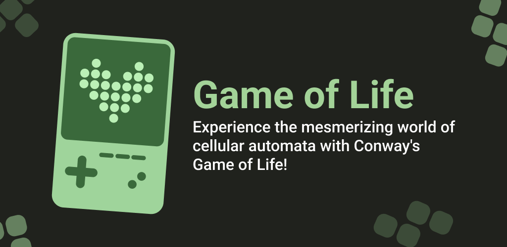
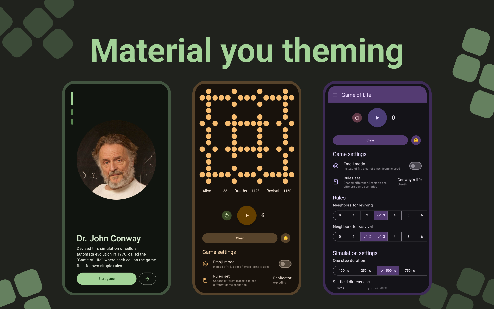
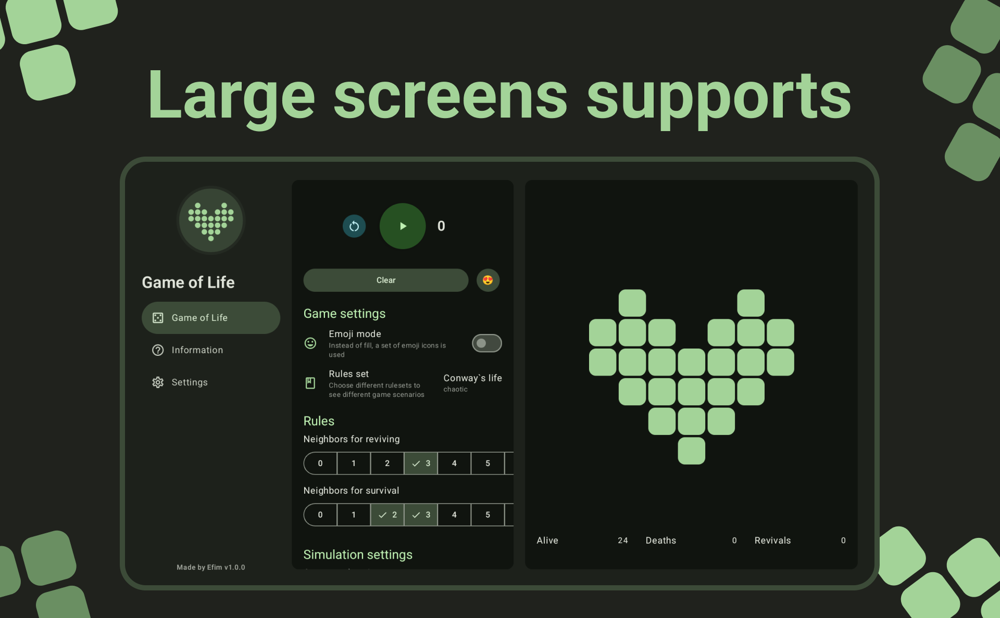

<h1 align="center">
    Conway's Game of Life
</h1>

 
   

 

## Description

The Game of Life, also known simply as "Life", is a cellular automaton
developed in 1970. It is a zero-player game, meaning that its evolution is determined by its initial state and
does not require additional actions. A person interacts with the Game of Life, creating an initial configuration
and watching how it develops. It is Turing complete and can model a universal constructor or any other Turing
machine.
> [!IMPORTANT]\
> ### Rules
>- In an empty (dead) cell, if there are exactly three living neighbors, life is born
>- If a living cell has two or three living neighbors, it continues to live; otherwise, the cell dies (due to "
   loneliness" or "overcrowding")

### Key features

- Simple controls: Tap to toggle cells and start the simulation.
- Adjustable speed: Control the pace of the simulation to observe patterns at your own rhythm.
- Customizable grid size: Tailor the dimensions of the grid to suit your preferences.
- Explore patterns: Discover famous configurations like gliders, blinkers, and more.
- Customize rules: Experiment with different rule sets to create new and unique simulations.

### App features

- Adaptive theming
- Localization
- BackdropScaffold usage
- Large screen support

## Design & Screenshots

### Phones

 
   

 

### Desktop | Tablet

 
   

 

> [!NOTE]\
> ### ⭐ If you liked the app, star this repository.
